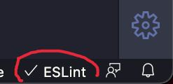

<p align="center">
  
</p>

<p align="center">
  
  
</p>

# Starter


## Environment

Lihat [Environment Used](./ENVIRONMENT_USED.md).

## Clone Project

Buka terminal / cmd, masuk ke folder yang ingin Anda tuju, lalu jalan kan

```bash <(curl -s https://raw.githubusercontent.com/react-crocodic/react_native_starter/master/support-files/installation.sh) NamaApp com.nama.app https://github.com/ACCOUNT/REPO.git```

## Running


#### Start React-Native Packager

Buka terminal / cmd arahkan posisi folder ke folder project lalu jalankan ```npm start```.

#### Run on Android

1. Hubungkan perangkat android dengan PC / laptop melalui USB.
2. Aktifkan **opsi pengembang** di pengaturan perangkat android.
3. Aktifkan opsi **USB Debugging** dalam list pengaturan **opsi pengembang**.
4. Buka terminal / cmd (jika React-Native Packager sedang berjalan maka gunakan jendela terminal / cmd baru), arahkan posisi folder ke folder project lalu jalankan ```npx react-native run-android```.

#### Run on iOS

Jalankan langkah di bawah ini untuk run di perangkat iOS:
1. Hubungkan perangkat iOS dengan perangkat MacOS melalui USB Lightning.
2. Buka terminal / cmd (jika React-Native Packager sedang berjalan maka gunakan jendela terminal / cmd baru), arahkan posisi folder ke folder project lalu jalankan ```npx react-native run-ios```.

#### Note

Apabila dalam proses running Anda belum menjalankan React-Native Packager, maka sistem otomatis akan mendeteksi dan membuka satu jendela terminal / cmd dengan React-Native Packager yang telah running di dalamnya.


## Set-Up EsLint

EsLint membantu untuk menyatakan peraturan-peraturan penulisan kode, ini membuat penulisan kode menjadi lebih disiplin dan konsisten.

Anda dapat mengubah konfigurasi peraturannya di file ```.eslintrc.js```, dan agar peraturan EsLint dapat berjalan, anda terlebih dahulu harus menginstall ekstensi [EsLint](https://marketplace.visualstudio.com/items?itemName=dbaeumer.vscode-eslint) di IDE Visual Studio Code anda.

Setelah terinstal, buka salah satu file javascript atau typescript, lihat di bagian bawah kanan visual studio code terdapat button bertuliskan EsLint, pastikan tercentang yang berarti menandakan bahwa ekstensi EsLint sudah berjalan.

<p align="center">
  
</p>


## Build


#### Build Android APK

Buka terminal / cmd arahkan posisi folder ke folder project lalu jalankan ```npm run build-android```.

#### Build iOS

Buka terminal / cmd arahkan posisi folder ke folder project lalu jalankan ```npm run bundle-ios```, kemudian build / archive melalui aplikasi XCode (XCode hanya tersedia bagi pengguna MacOS).